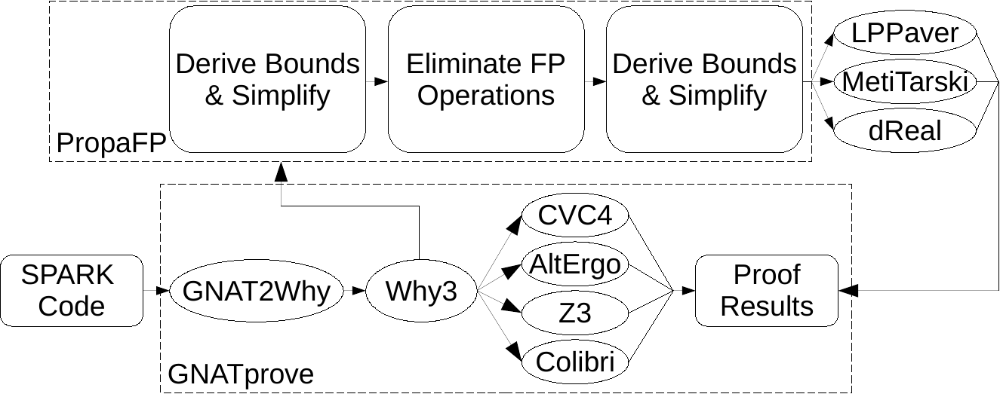

# PropaFP

<!-- TODO: Emphasise integration with GNAT Studio/SPARK/Ada , verifying floating-point programs -->
<!-- TODO: Add figure from paper for above -->
<!-- TODO: Add to first paragraph -->
<!-- TODO: Stack install instructions -->

PropaFP is a tool used for auto-active verification of Floating-Point programs.
PropaFP can be used for the verification of [SPARK][1]/[Ada][2] floating-point programs and is integrated with [GNAT Studio 2022](https://www.adacore.com/gnatpro/toolsuite/gnatstudio).

PropaFP can take some Verification Condition (VC), and if PropaFP understands the VC, simplify it, derive bounds for variables, and safely eliminate floating-point operations using over-approximations on rounding errors.
A more detailed description of PropaFP can be found in [this paper](https://arxiv.org/abs/2207.00921).

Below is a diagram summarising the integration with PropaFP and SPARK.

[1]: https://en.wikipedia.org/wiki/SPARK_(programming_language)
[2]: https://en.wikipedia.org/wiki/Ada_(programming_language)

## Requirements

All PropaFP executables require the [FPTaylor v0.9.3](https://github.com/soarlab/FPTaylor/releases/tag/v0.9.3) executable in your $PATH.

The 'propafp-run-$prover' executables require you to have $prover installed (but not necessarily in your $PATH).

To build PropaFP, we recommend [Stack](https://docs.haskellstack.org/en/stable/README/). We have built PropaFP with Stack version 2.7.5.

## Installation

- Download/Clone this repository
- cd into the repo
- Run `stack build`

Stack will then build the project and tell you where the PropaFP executables have been placed.

### Supported Provers

Currently, PropaFP supports:

- [dReal4](https://github.com/dreal/dreal4) (Tested on v4.21.06.2)
- [LPPaver](https://github.com/rasheedja/LPPaver) (Tested on v0.1.0.0)
- [MetiTarski](https://www.cl.cam.ac.uk/~lp15/papers/Arith/) (Tested on v2.4)

## Usage

PropaFP can work as a standalone program or with GNAT Studio 2022.

### PropaFP as a Standalone Program

To produce some input for PropaFP, see the [Reference](REFERENCE.md).

#### Translator Executables

PropaFP contains 'translator' executables, which takes some input file, transforms the VC as described above, and produces another input file for the target prover.
The current 'translator' executables are:

- propafp-translate-dreal      -f [smtFileContainingVC.smt2] -t [fileToWrite.smt2]
- propafp-translate-metitarski -f [smtFileContainingVC.smt2] -t [fileToWrite.smt2]

The propafp-translate-dreal executable can also be used for LPPaver.
If PropaFP does not understand the VC, it writes an empty file.

#### Runner Executables

'Runner' executables take some input file, transform the VC as described above, and calls the prover on the transformed VC.
'Runner' executables require the prover for each executable to be in your $PATH.
The current 'runner' executables are:

- propafp-run-dreal      -f [smtFileContainingVC.smt2] -p [pathToDReal]
- propafp-run-lppaver    -f [smtFileContainingVC.smt2] -p [pathToLPPaver]
- propafp-run-metitarski -f [smtFileContainingVC.smt2] -p [pathToMetiTarski]

To run LPPaver in a mode specialised to find counter-examples, you can pass the -c option.

### PropaFP with GNAT Studio

For instructions to use with GNAT Studio 2022, see [sparkFiles/INSTRUCTIONS.md](sparkFiles/INSTRUCTIONS.md)

## Guided Example

[A guided example of using PropaFP with GNAT Studio.](sparkFiles/EXAMPLE.md)
