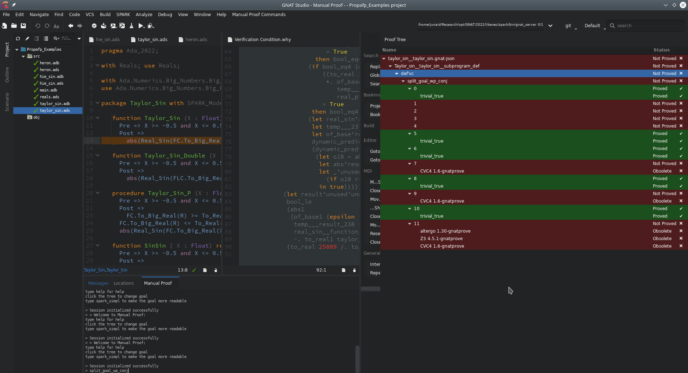
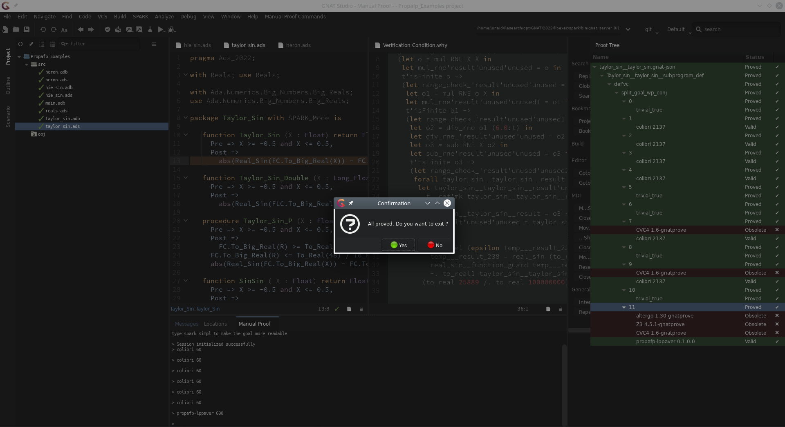

# Example

Say we want to verify the `Taylor_Sin` function in [examples/spark/taylor_sin.ads](../examples/spark/taylor_sin.ads).
When trying to verify this specification, SMT solvers will fail.

Right-click the message, select `SPARK -> Start Manual Proof`.


In our case, GNATprove performs the `split_goal_wp_conj` transformation for us. However, sometimes you need to do this manually as follows: In the proof tree, select the top-level VC by clicking on `def'vc` and, in the `Manual Proof` pane at the bottom, type in `split_goal_wp_conj` and hit enter.



Try SMT solvers on all the unverified (red) splits (i.e. VCs labelled 0, 1, 2...).
We recommend running the following on each split VC until it is verified or you have tried all of the following provers. The 60 for each prover is used to set a timeout of 1 minute.

```
colibri 60
cvc4 60
altergo 60
z3 60
```

The order in which you run the above provers is not important, however we do recommend running colibri first as it is typically quick to return a result.

In this example, none of the SMT solvers can decide the final VC, labelled 11.
All of the provers supported by PropaFP can verify this. You can test this by entering one of/all of the following commands:

```
propafp-lppaver 600
propafp-dreal 600
propafp-metitarski 600
```

Once all the split VCs are verified, the original VC is also verified.


